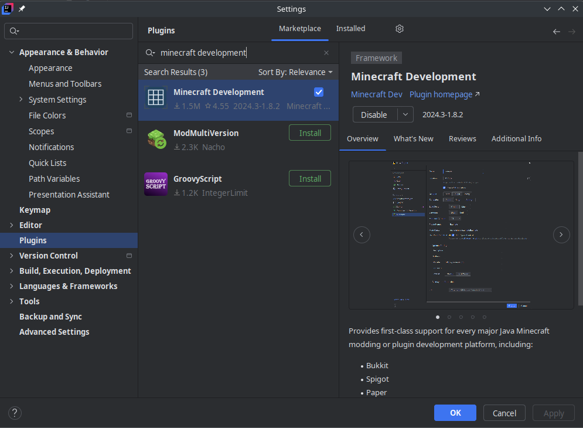
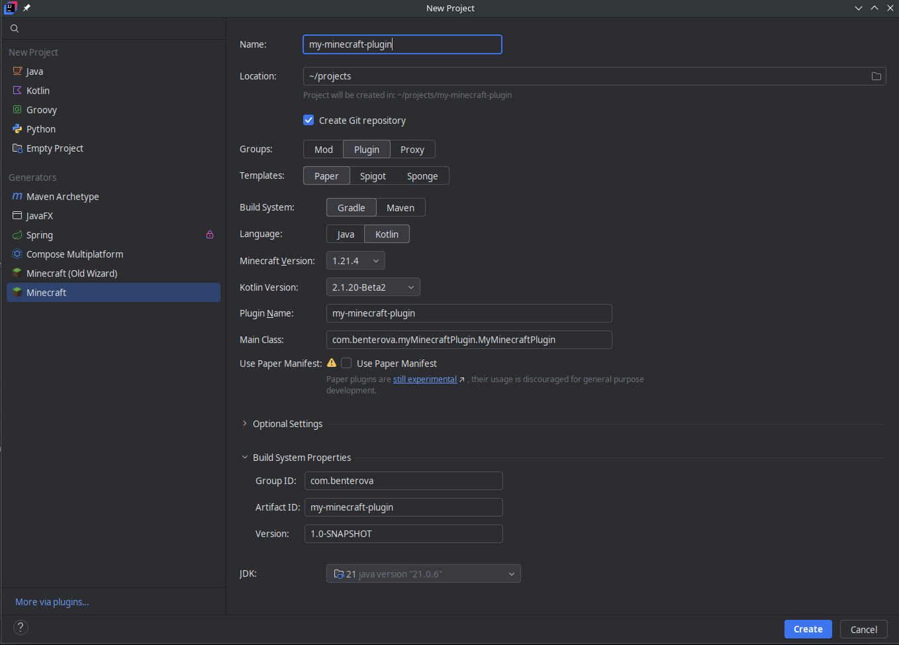

+++
title = 'Developing Minecraft Plugins with Paper & Kotlin'
description = "Get started making your first server-side plugin using Kotlin & Paper"
date = 2025-01-31
draft = false
keywords = 'minecraft,plugins,paper,modding,development,kotlin'
+++

# Getting Started

To get started creating Minecraft plugins in Kotlin with Paper, you'll first need to set up your development environment. While my usual IDE of choice is Visual Studio Code, unfortunately the Kotlin support for VSCode isn't very mature, and things like debugging support and a language server aren't easily configured or feature-complete.

If you haven't already, ensure you have the JDK version of Java 21 installed. This can be downloaded [from here](https://www.oracle.com/java/technologies/downloads/#jdk21) or from your package manager of choice.

For these reasons and for the sake of this post, we'll primarily be focused on using IntelliJ IDEA. You can download it for your current platform [here](https://www.jetbrains.com/idea/download/).

On Linux, IDEA can be installed with your package manager of choice. I'm using Arch, so I installed it using `yay -S intellij-idea-community-edition`

# Configuring IDEA for plugin development
The "Minecraft Development" plugin for IDEA allows us to automatically generate and configure our plugin. Open the Plugins pane in IDEA (Ctrl+Shift+X) and search for "Minecraft Development" in the Marketplace tab

After this is installed, you can create a New Project (File -> New Project) and select Minecraft from the Generators pane on the left of the window. Select "Plugin", "Kotlin", and ensure "Gradle" is selected.

Once this is configured to your liking, click Create.

# Debugging
The PaperMC docs has pretty thorough documentation on how to configure 